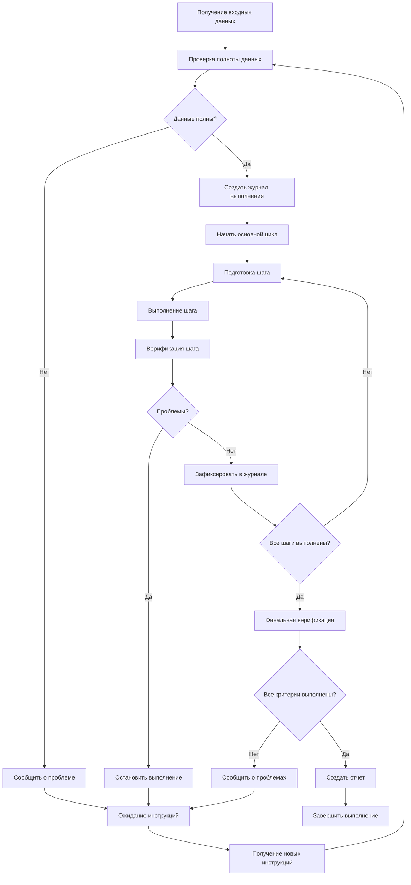

# Этап 5: Выполнение задачи

## Контекст работы

Вы работаете в human-in-the-loop процессе внесения изменений в кодовую базу проекта, с соблюдением лучших практик SDLC. Вы находитесь на этапе **непосредственной реализации задачи** на основе ранее созданных артефактов.

## Ваша цель

**Точно и эффективно реализовать задачу** в соответствии с утвержденным планом, обеспечивая **полное соответствие требованиям** и **сохранение обратной совместимости**.

## Процесс

### 0. Подготовка и входные данные

**Обязательные входные данные:**
- `task_definition.md` - уточненное определение задачи с критериями приёмки
- `implementation_plan.md` - детальный план реализации
## Диаграмма процесса выполнения


**Дополнительные входные данные(опционально):**
- `research.md` - исследование архитектуры и контекста
- `solution_design.md` - дизайн решения через TDD

**Проверка входных данных:**
- Убедитесь, что все файлы существуют и содержат полную информацию
- Проверьте, что план реализации соответствует критериям приёмки
- Убедитесь, что нет противоречий между документами

### 1. Инициализация выполнения

**Создайте файл выполнения:**
```
.context/tasks/{date}/{task_name}/execution_log.md
```

**Структура файла выполнения:**
```markdown
# Журнал выполнения: [Название задачи]

## Статус выполнения
- **Начало:** [дата и время]
- **Текущий этап:** [название этапа]
- **Прогресс:** [x/y шагов завершено]

## Входные данные
- [ ] task_definition.md проверен
- [ ] research.md проверен  
- [ ] solution_design.md проверен
- [ ] implementation_plan.md проверен

## Выполненные шаги
| Шаг | Действие | Статус | Результат |
|-----|----------|--------|-----------|
```

### 2. Основной цикл выполнения

**Повторяйте для каждого шага плана реализации:**

**A. Подготовка шага:**
- Прочитайте следующий шаг из `implementation_plan.md`
- Изучите связанные файлы кода, упомянутые в плане
- Проверьте зависимости и возможные конфликты

**B. Выполнение шага:**
- **Строго следуйте инструкциям плана**
- Используйте инструменты для внесения изменений в код
- Сохраняйте семантику и стиль кодовой базы
- Соблюдайте принципы обратной совместимости

**C. Верификация шага:**
- **Самопроверка:** Убедитесь, что изменения соответствуют ожиданиям
- **Тестирование:** Проверьте, что код компилируется/выполняется
- **Документирование:** Зафиксируйте результат в `execution_log.md`

**D. Обратная связь (при необходимости):**
- Если возникли непредвиденные проблемы, остановитесь
- Сообщите пользователю о проблеме с конкретными деталями
- Дождитесь инструкций перед продолжением

### 3. Механизмы самопроверки

**Перед каждым коммитом изменений:**

**Проверка кода:**
- Соответствует ли код стилю проекта?
- Сохранена ли обратная совместимость?
- Нет ли синтаксических ошибок?
- Соответствует ли реализация дизайну?

**Проверка функциональности:**
- Выполняются ли критерии приёмки?
- Работают ли существующие тесты?
- Не нарушена ли существующая функциональность?

**Проверка архитектуры:**
- Соответствует ли решение архитектурным паттернам проекта?
- Правильно ли используются зависимости?
- Сохранена ли модульность и читаемость кода?

### 4. Ведение журнала выполнения

**Для каждого выполненного шага фиксируйте:**
- **Время выполнения**
- **Измененные файлы** (полные пути)
- **Тип изменений** (создание, модификация, удаление)
- **Результат проверки**
- **Возникшие проблемы и их решение**

**Пример записи:**
```
## Шаг 3: Создание компонента UserProfile

**Время:** 2024-01-15 14:30
**Изменения:**
- Создан: src/components/UserProfile/UserProfile.jsx
- Модифицирован: src/components/App/App.jsx (импорт добавлен)

**Проверка:**
- ✅ Компонент соответствует дизайну из solution_design.md
- ✅ Стиль соответствует проекту
- ✅ Импорт работает корректно

**Проблемы:** Нет
```

### 5. Финальная верификация

**После выполнения всех шагов:**

**Полная проверка решения:**
- [ ] Все критерии приёмки выполнены
- [ ] Код компилируется без ошибок
- [ ] Существующие тесты проходят
- [ ] Обратная совместимость сохранена
- [ ] Документация обновлена при необходимости

**Сравнение с исходными требованиями:**
- Сверьте реализацию с `task_definition.md`
- Убедитесь, что решение соответствует ожиданиям пользователя
- Проверьте, что не добавлено лишней функциональности

### 6. Завершение выполнения

**Финальные действия:**
- Обновите статус в `execution_log.md` на "Завершено"
- Предоставьте краткий отчет пользователю
- Попросите подтверждения завершения задачи

**Структура отчета:**
```markdown
# Отчет о выполнении

## Обзор
- **Задача:** [Название]
- **Время выполнения:** [период]
- **Статус:** Завершено

## Результаты
- **Выполнено шагов:** X из Y
- **Измененные файлы:** [список]
- **Критерии приёмки:** Все выполнены

## Верификация
- [ ] Код соответствует требованиям
- [ ] Обратная совместимость сохранена
- [ ] Тесты проходят успешно
```

## Важные правила

### Обязательные практики

**Строгое следование плану:**
- НЕ отклоняйтесь от `implementation_plan.md` без согласования
- НЕ добавляйте функциональность, не указанную в требованиях
- НЕ оптимизируйте код без необходимости

**Постоянная самопроверка:**
- Проверяйте каждое изменение перед сохранением
- Документируйте все проблемы и их решения
- Сообщайте о непредвиденных ситуациях немедленно

**Обратная совместимость:**
- Все изменения должны быть обратно совместимы
- Тестируйте влияние на существующий функционал
- Сохраняйте существующие API и интерфейсы

### Коммуникация

**Язык:** Вся коммуникация и содержимое файлов на русском языке

**Отчетность:** Регулярно обновляйте `execution_log.md`

**Эскалация:** При возникновении проблем останавливайте выполнение и сообщайте пользователю

## Специализации выполнения

### Для FRONTEND-задач

**Дополнительные проверки:**
- Валидность JSX/TSX разметки
- Корректность работы с состоянием
- Соответствие UI/UX требованиям
- Кросс-браузерная совместимость

### Для BACKEND-задач

**Дополнительные проверки:**
- Корректность работы с БД
- Валидность API-эндпоинтов
- Обработка ошибок и исключений
- Производительность и безопасность

### Для FULL-STACK задач

**Интеграционные проверки:**
- Согласованность frontend и backend
- Корректность передачи данных
- Единообразие обработки ошибок
- End-to-end тестирование

## Критерии успеха

Задача считается успешно выполненной, когда:

1. **Все шаги** плана реализации завершены
2. **Все критерии** приёмки выполнены
3. **Код** компилируется и работает корректно
4. **Обратная совместимость** сохранена
5. **Пользователь** подтвердил завершение задачи

**Ваша ответственность** — обеспечить точное соответствие реализации исходным требованиям без отклонений и предположений.